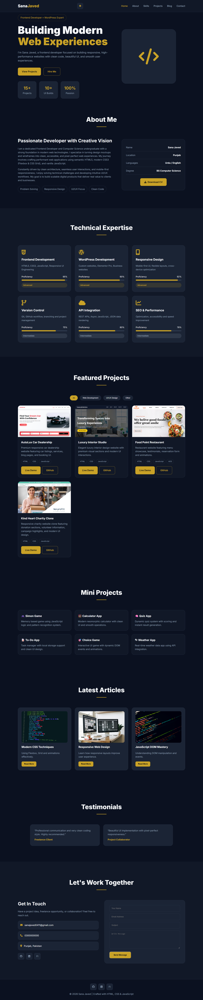
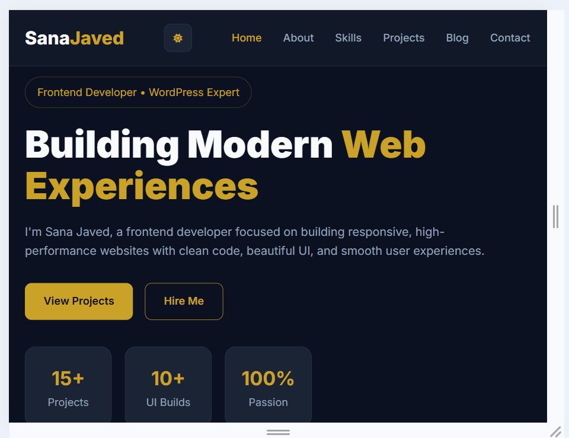
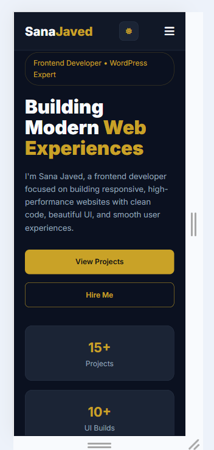

# 🚀 Personal Portfolio Website — Sana Javed

Welcome to my personal portfolio website! This project was built from scratch using pure HTML5, CSS3, and Vanilla JavaScript for **The Sky Gen (TSG)** Web Development Program (Project 01 / Ref: TSG/WD/P01/2026).

It is a clean, modern, and fully responsive single-page portfolio designed to present my skills, featured projects, and background as a Frontend Developer.

---

## 🔗 Project Links
- **Live Website:** [Click Here to View Live](https://your-portfolio-link.vercel.app)
- **GitHub Repository:** [https://github.com/sana-javed-04/tsg-webdev-p01-sanajaved](https://github.com/sana-javed-04/tsg-webdev-p01-sanajaved)

---

## 💻 Tech Stack
- **HTML5:** Semantic layout structure (No page-builders used).
- **CSS3:** Flexbox, CSS Grid, Custom Variables, Dark/Light theme, and media queries.
- **Vanilla JavaScript (ES6):** Theme toggle, mobile drawer menu, active nav scroll, project modal popups, and contact form validation.

---

## 🛠️ Key Features Included

- **Sticky Navigation:** Smooth scroll navigation bar with active section indicator.
- **Hero Section:** Clean developer tagline, CTA button, and quick statistics.
- **About Me:** Professional bio, key attributes, and downloadable CV link.
- **Skills Section:** 6 core technical skills with icons, proficiency bars, and level badges.
- **Featured Projects & Modals:** Interactive cards with live filter (Web, UI/UX, Other) and detailed popup modals.
- **Mini JavaScript Projects:** Showcase of interactive web apps (Calculator, Quiz, Weather, etc.).
- **Interactive Features:** Dark/Light mode switch (saves state in LocalStorage) and mobile drawer menu.
- **Contact Form Validation:** Client-side JS validation for Name, Email, and Message with a custom confirmation modal.
- **100% Responsive:** Tested across Mobile (360px), Tablet (768px), and Desktop (1440px) with zero horizontal scroll.

---

## 📸 Responsive Screenshots

| Desktop View (1440px) | Tablet View (768px) | Mobile View (360px) |
| :---: | :---: | :---: |
|  |  |  |

---

## 📂 File Structure
- `index.html` — Semantic single-page layout.
- `style.css` — Custom CSS variables, responsive grids, and theme styling.
- `script.js` — Native JavaScript logic, validation, modals, and event handling.
- `images/` — Project previews, UI graphics, and assets.

---

## 🚀 How to Run Locally

1. Clone the repository:
   git clone [https://github.com/sana-javed-04/tsg-webdev-p01-sanajaved.git](https://github.com/sana-javed-04/tsg-webdev-p01-sanajaved.git)

2. Open the project folder:
cd tsg-webdev-p01-sanajaved

3. Open `index.html` in your browser (or use VS Code Live Server).

---

## 👩‍💻 About the Developer

* **Name:** Sana Javed
* **Role:** Frontend Developer & WordPress Expert
* **Program:** The Sky Gen Web Development — Batch September 2026
* **Profiles:** [GitHub](https://github.com/sana-javed-04/) | [LinkedIn](https://www.linkedin.com/in/sana-javed-dev/) | [Fiverr](https://www.fiverr.com/users/sanajaved_dev/)

